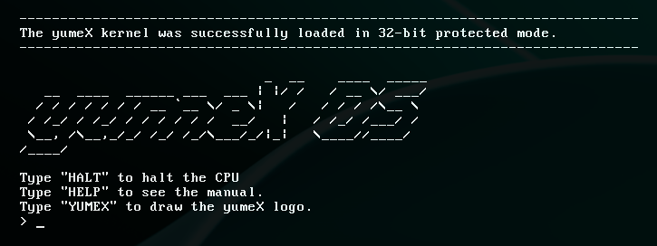

# yumeX OS

!!! The project has not been completed yet...

yumeX Hello World:



## How to run:
```
make run
```
### Dependencies: qemu

## How to build:
```
make build
```

### Dependencies: i686-elf-gcc, i686-elf-ld

## GCC Cross Compiler osdev guide
- https://wiki.osdev.org/GCC_Cross-Compiler

## Links
- https://github.com/lukearend/x86-bootloader
- https://github.com/cfenollosa/os-tutorial