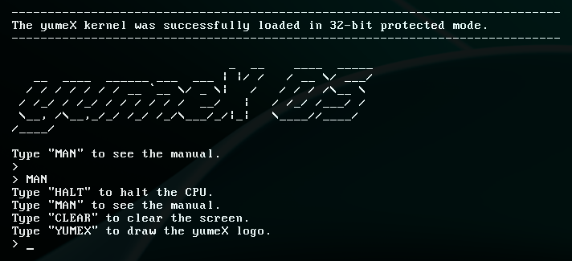
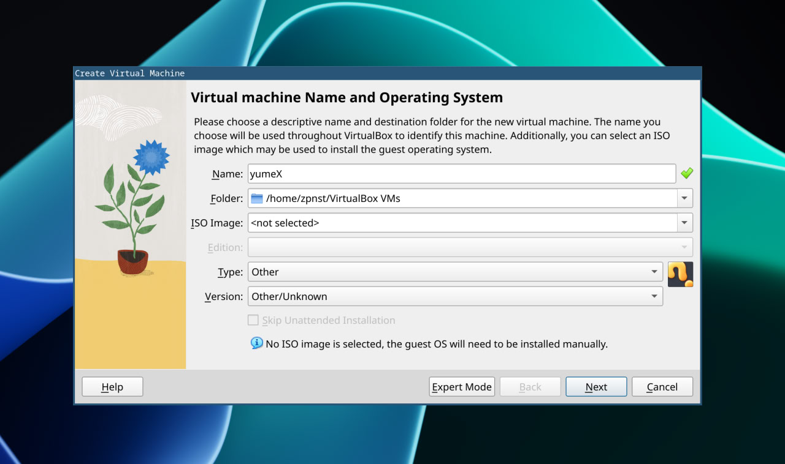
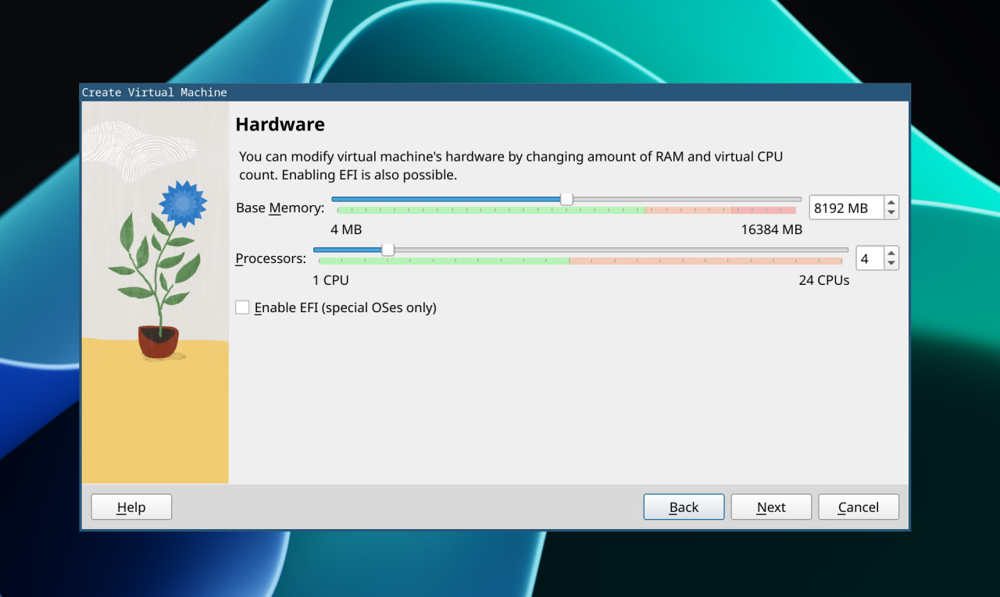
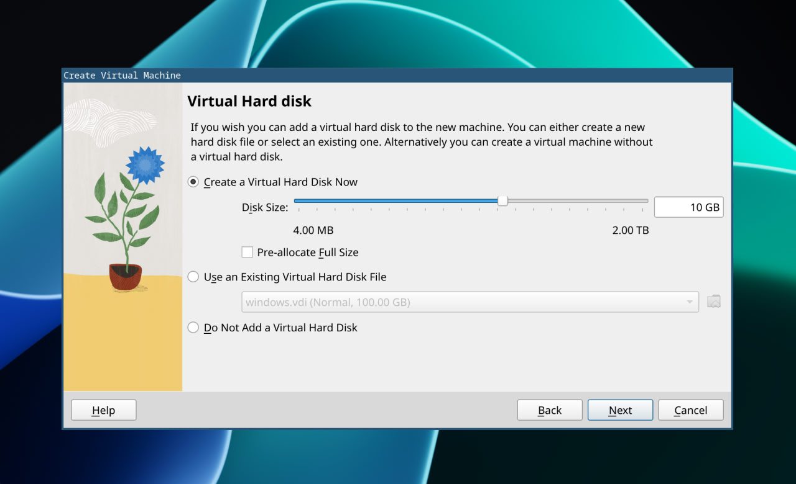
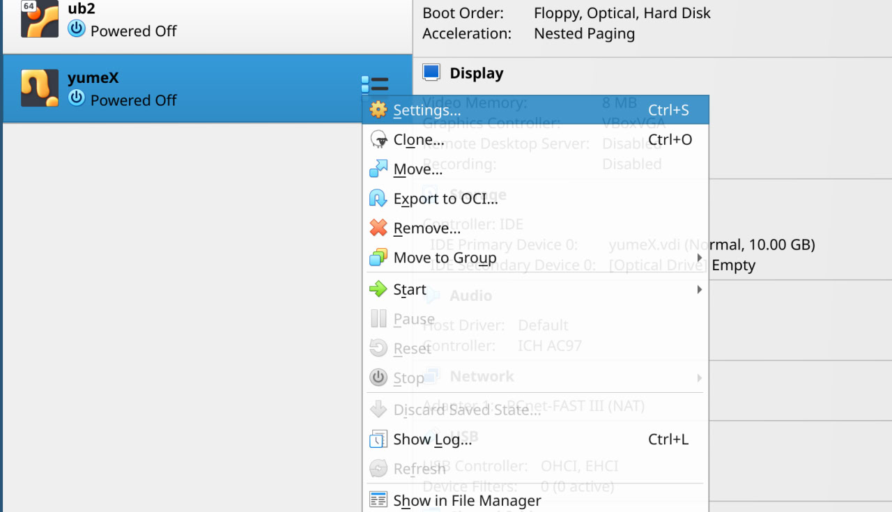
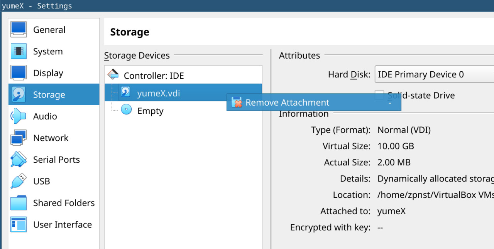
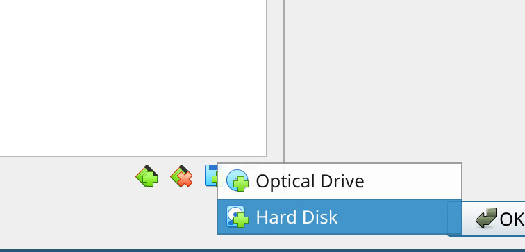
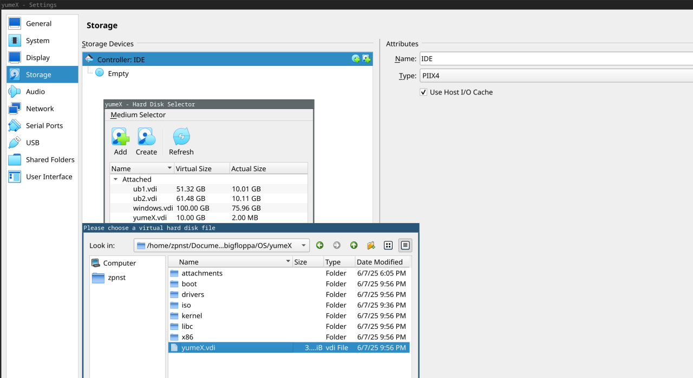

# yumeX OS

!!! The project has not been completed yet...

yumeX Hello World:



## How to run via qemu:
```
make run
```
### Dependencies: 
- qemu-system-x86_64 (by default for many Linux distributions)

## How to build:
```
make build
```

### Dependencies: 
- i686-elf-gcc
- i686-elf-ld

## How to run via VirtualBox:

To create a new VM, click "New"

Next, do as shown in the pictures (we do not select an ISO image, we create a virtual machine via a VDI file)

Let's enter the name of the VM, for example "yumeX"


After that, you need to configure the virtual machine settings, you can select them yourself, or you can do it as shown in the picture.

After setting the parameters, click on "Finish"



After creating a virtual machine, go to the settings, select the "Storage" section and delete the basic VDI file that was created by default.




Next, at the bottom of the screen, click on "Add Attachment" and select "Hard Disk"


In the window that opens, click on "Add" and select yumeX.vdi file that lies at the root of the repository


After all this, save the result, click on "Ok" in the lower-right corner of the settings window and the VM is ready!

Click on the green "Start" arrow at the top of the screen to start the VM

## GCC Cross Compiler osdev guide
- https://wiki.osdev.org/GCC_Cross-Compiler

## Links
- https://github.com/lukearend/x86-bootloader
- https://github.com/cfenollosa/os-tutorial