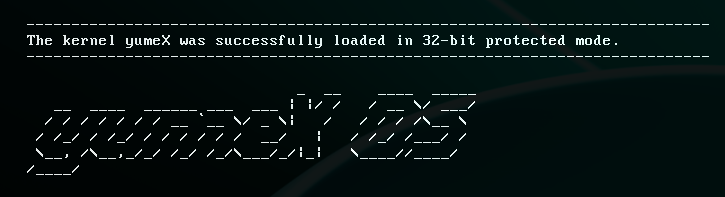

# yumeX OS

!!! The project has not been completed yet...

That's all this operating system can do (yes, just output text about its boot =)):



## How to run:
```
make run && make clean
```

### Dependencies:
1) qemu-system
2) i686-elf-gcc, i686-elf-gdb, i686-elf-ld

## GCC Cross Compiler osdev guide
https://wiki.osdev.org/GCC_Cross-Compiler
